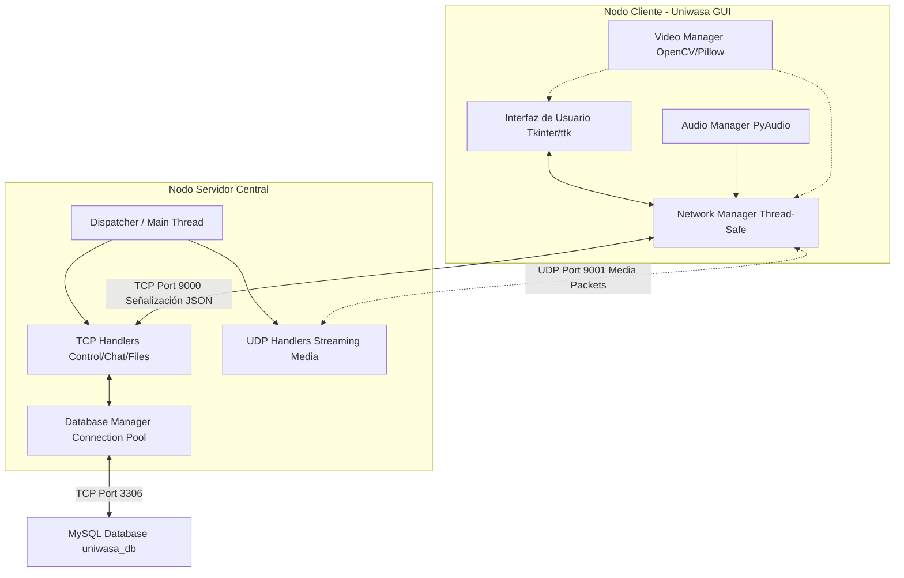
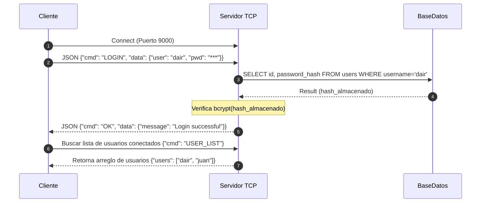
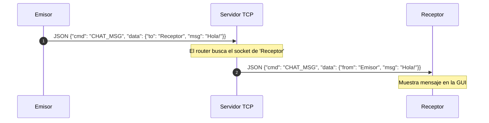
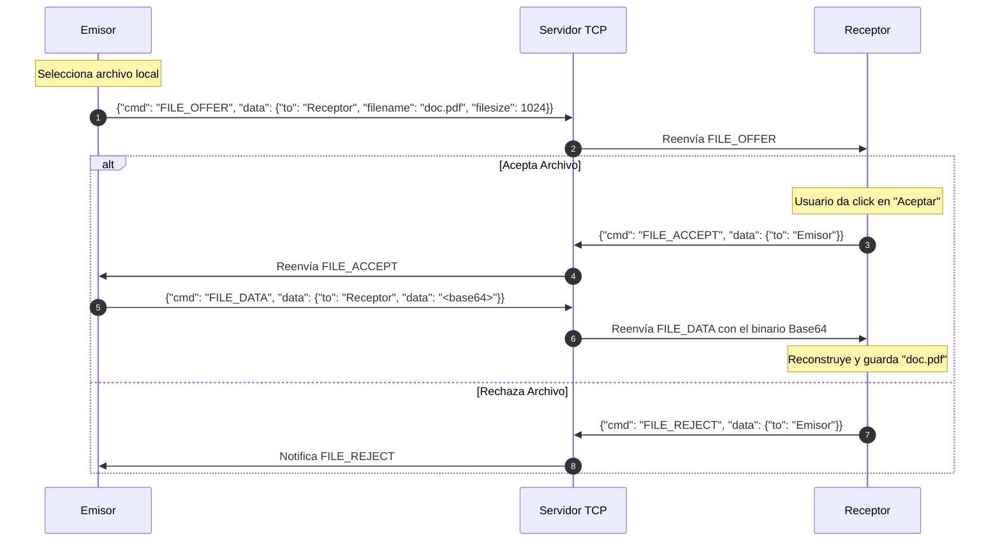
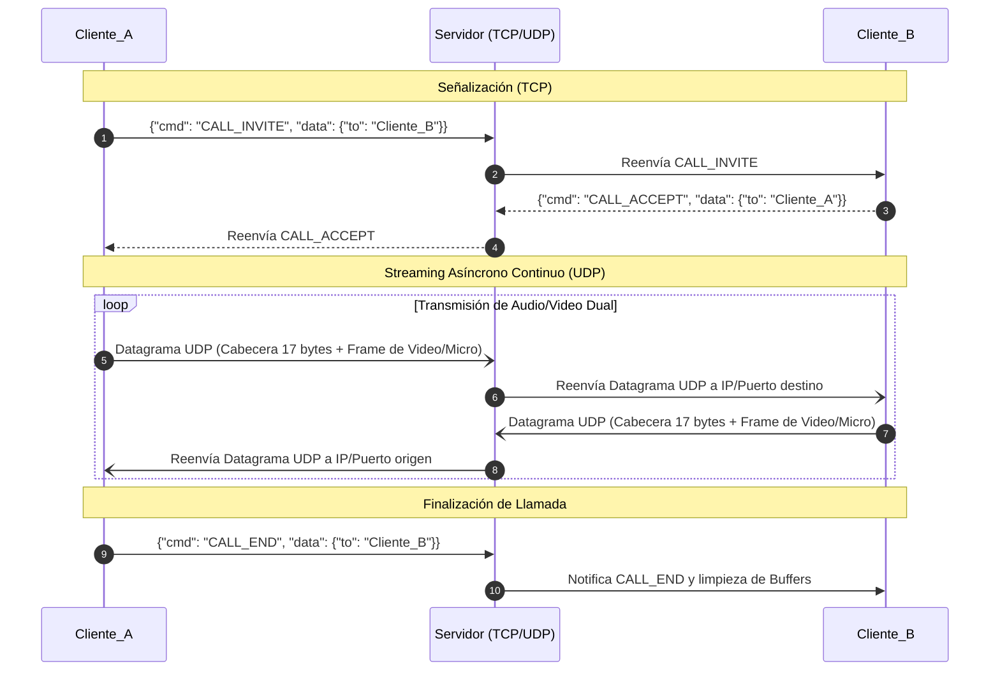
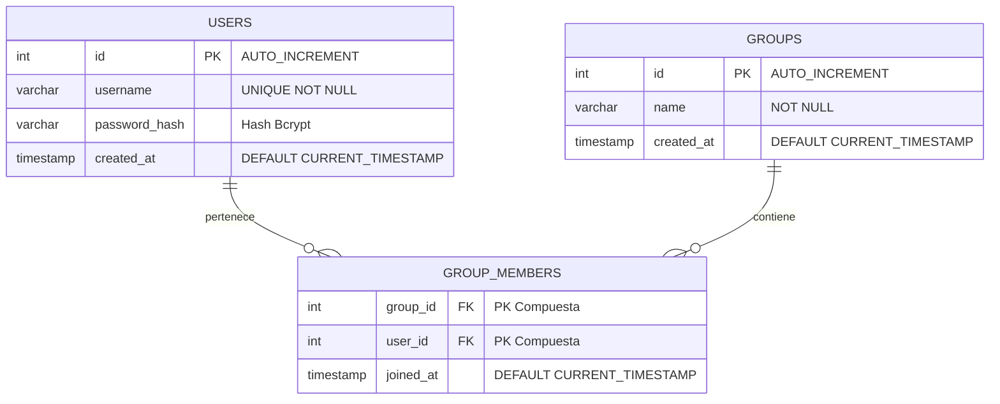

<div align="center">
  <h1>🚀 Uniwasa</h1>
  <h3>Plataforma de Mensajería Instantánea y Teleconferencias</h3>
  <p><i>Proyecto de Documentación de Software - Universidad Nacional de Ingeniería (FIIS UNI)</i></p>
</div>

---

## 📘 Tabla de Contenidos

- [1. Descripción del Proyecto](#1-descripción-del-proyecto)
- [2. Objetivos](#2-objetivos)
- [3. Arquitectura del Sistema](#3-arquitectura-del-sistema)
  - [3.1. Vista Lógica (Patrón de Arquitectura)](#31-vista-lógica-patrón-de-arquitectura)
  - [3.2. Diagrama de Componentes](#32-diagrama-de-componentes)
  - [3.3. Protocolos de Red](#33-protocolos-de-red)
- [4. Modelo de Datos (Base de Datos)](#4-modelo-de-datos-base-de-datos)
- [5. Tecnologías Utilizadas](#5-tecnologías-utilizadas)
- [6. Instalación y Despliegue](#6-instalación-y-despliegue)
- [7. Guía de Uso](#7-guía-de-uso)
- [8. Licencia y Contacto](#8-licencia-y-contacto)

---

## 📖 1. Descripción del Proyecto

**Uniwasa** es una aplicación cliente-servidor de escritorio orientada a resolver las necesidades de comunicación interna, permitiendo a los usuarios interactuar a través de múltiples canales (texto, voz, video y transferencia de archivos).

Este proyecto ha sido desarrollado como una solución propia (self-hosted), lo que garantiza autonomía en la gestión de ancho de banda y control absoluto de los grupos de usuarios frente a alternativas comerciales y públicas de mensajería.

---

## 🎯 2. Objetivos

- **Objetivo General:** Desarrollar un sistema unificado de comunicaciones que soporte transferencias multimedia en tiempo real.
- **Objetivos Específicos:**
  - Implementar conexiones TCP estables para el enrutamiento de mensajes y procesos de señalización de sesiones.
  - Implementar conexiones UDP de baja latencia para el streaming de audio y video.
  - Desarrollar una interfaz gráfica moderna, asincrónica y responsiva que no se bloquee durante la espera I/O de red.
  - Diseñar un modelo centralizado de base de datos relacional (MySQL) para persistir cuentas de usuario y la conformación de grupos.

---

## 🧩 3. Arquitectura del Sistema

La solución implementa una **Arquitectura Cliente-Servidor Centralizada**. El servidor actúa como un *broker* general para la gestión de estado de los clientes conectados, multiplexando señales y retransmitiendo los flujos de datos según los destinatarios asignados.

### 3.1. Vista Lógica (Patrón de Arquitectura)
- **Cliente:** Se apoya en un patrón **Observer/MVC modificado**, donde la interfaz (`gui_manager`), la captura multimedia (`video_manager`, `audio_manager`) actúan de forma asíncrona, suscribiéndose a los eventos de un gestor de red (`network_manager`).
- **Servidor:** Emplea un modelo de **concurrencia multihilo (Multi-threading)**. Cada cliente entrante es asignado a un hilo de ejecución dedicado (`handlers.py`), previniendo condiciones de carrera con *Locks* en recursos compartidos, como la lista global de *sockets* activos y el *pool* de base de datos.

### 3.2. Diagrama de Componentes

El siguiente diagrama detalla la integración de los subsistemas y el flujo bidireccional de información:



### 3.3. Diagramas de Secuencia (Flujo de Operaciones)

A continuación se detalla cómo se gestionan los principales flujos de interacción entre los clientes y el servidor central:

#### A. Autenticación (Login)


#### B. Envío de Mensajes de Texto (Chat Privado)


#### C. Transferencia P2P Reenrutada de Archivos


#### D. Teleconferencia (Señalización TCP -> UDP Media)


### 3.3. Protocolos de Red
- **TCP (Capa de Control):** Utilizado para eventos estrictos y secuenciales: Inicios de sesión, intercambio de llaves y mensajes (Chat privado/grupal), *Offers* de transferencia de archivos y establecimiento (inicio/fin) de videollamadas. Todo empaquetado en JSON estructurado.
- **UDP (Capa de Medios):** Utilizado para el envío rápido de *frames* de video (OpenCV -> bytes) y *chunks* de audio. Incorpora una cabecera binaria personalizada (`struct` de Python 17 bytes: Tipo, Session ID, Sender ID y Secuencia) para reenseblaje e identificación en conferencias grupales.

---

## 🗄️ 4. Modelo de Datos (Base de Datos)

El sistema emplea **MySQL** administrado a través de un *Connection Pool* de 10 conexiones simultáneas para evitar cuellos de botella. 
Al inicializarse, despliega automáticamente el siguiente modelo lógico relacional (DDL automático en `database.py`):



---

## 🛠 5. Tecnologías Utilizadas

| Categoría | Tecnología / Librería | Propósito / Uso en la Arquitectura |
| :--- | :--- | :--- |
| **Lenguaje Core** | Python 3.8+ | Desarrollo integral del *Backend* y *Frontend*. |
| **Interfaz (GUI)** | Tkinter + `ttk` | Renderizado rápido de la aplicación de escritorio. |
| **Multimedia** | OpenCV-Python, PyAudio, Pillow | Captura de cámara, micrófono y renderizado visual en TK. |
| **BBDD y ROM** | MySQL, `mysql-connector-python` | Almacenamiento persistente mediante Pool de Conexiones. |
| **Seguridad** | `bcrypt` | Hashing unidireccional de contraseñas (Salting). |
| **Capa de Red** | Sockets Nativos | `socket` TCP estricto (SOCK_STREAM) y UDP (SOCK_DGRAM). |

---

## 🔧 6. Instalación y Despliegue

### Requisitos Previos del Sistema
- Intérprete de Python (v3.8 o superior) en el `PATH` del sistema.
- Servidor MySQL o MariaDB ejecutándose en el entorno local u hospedado.
- (Cliente) Cámara web y micrófono debidamente configurados a nivel sistema operativo.

### Pasos de Configuración

1. **Clonar o descargar el proyecto** al entorno local.
2. **Instalar los paquetes requeridos :**
   ```bash
   pip install -r requirements.txt
   ```
3. **Configurar las credenciales Globales:**
   Abrir o editar el archivo `config.ini` situado en la raíz del proyecto.
   ```ini
   [DATABASE]
   host = localhost
   user = root
   password = [tu_contraseña]  # Dejar en blanco si el root no tiene contraseña
   database = uniwasa_db

   [SERVER]
   host = x.x.x.x # Opcional: Especificar la IP de la máquina host
   tcp_port = 9000
   udp_port = 9001
   ```

---

## ▶ 7. Guía de Uso

El ecosistema entero se levanta ejecutando los *endpoints* principales de su respectivo módulo.

1. **Despliegue del Servidor:**
   Abre una terminal y ejecuta:
   ```bash
   python server/main.py
   ```
   *(El servidor gestionará automáticamente la DDL creando las tablas MySQL si es necesario).*

2. **Ejecución de Clientes:**
   Desde otros equipos de la red LAN, ejecutar la GUI:
   ```bash
   python client/main.py
   ```
  *Nota: Si el cliente no puede resolver la conexión especificada en el archivo `.ini`, lanzará un *fallback prompt* nativo consultando cuál es la IP manual del servidor para conectarse.*

---

## 📝 8. Licencia y Contacto

- **Licencia:** Este proyecto está bajo la licencia **UNI**.
- **Desarrolladores:** Dair Ramos, Marco Gomez, Pablo Muñoz, Angel Ramirez 
- **Institución:** Universidad Nacional de Ingeniería (FIIS UNI)
- **Código UNI:** 20232156D
- **Contacto:** dair.ramos.j@uni.pe

