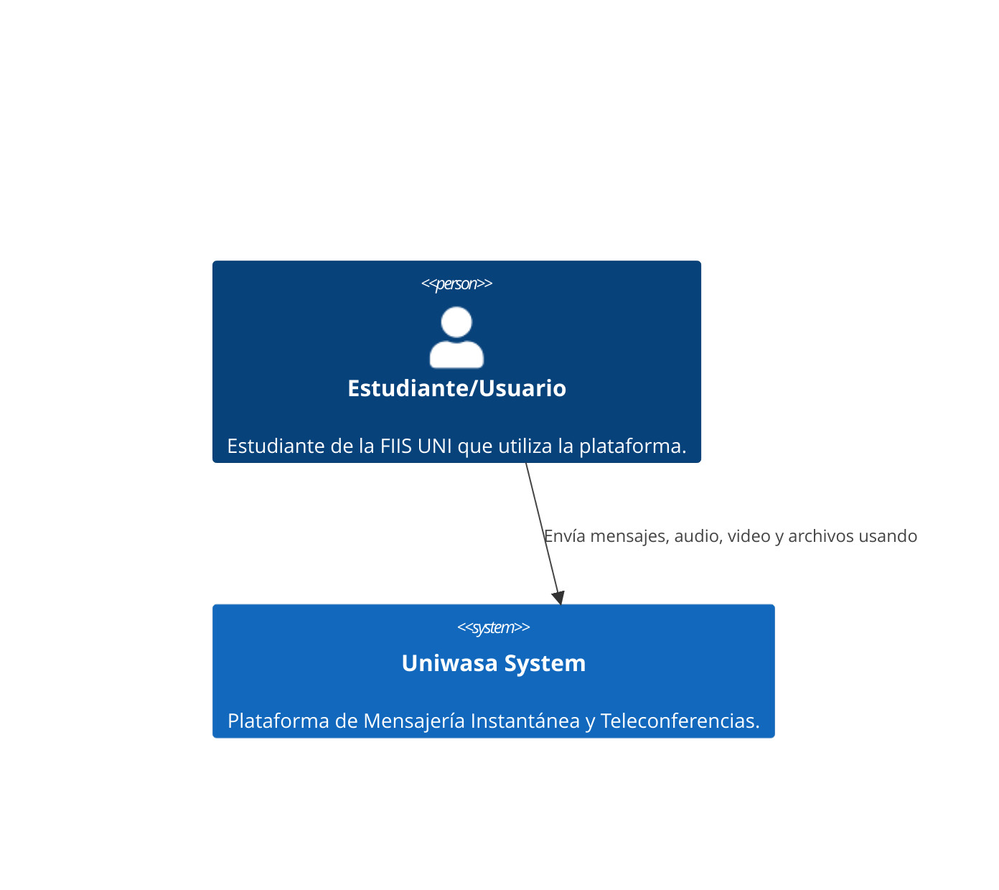
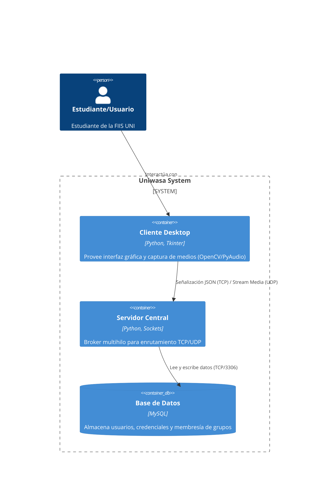
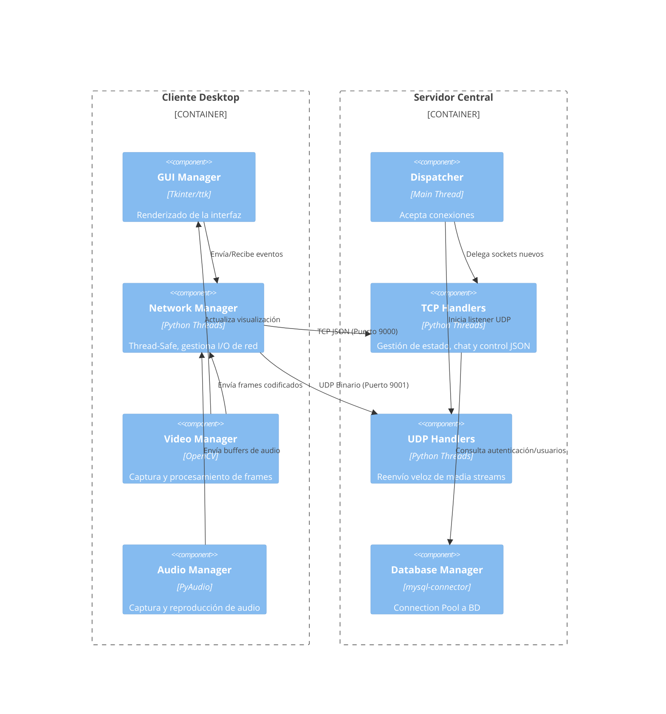

# 🛠 Documentación de Desarrollo (Uniwasa)

Esta documentación técnica está dirigida a desarrolladores y arquitectos de software que requieran entender a profundidad la estructura interna, decisiones de diseño, despliegue y el modelo de datos de **Uniwasa**.

---

## 🏗 1. Modelo C4 (Context, Container, Component)

El Modelo C4 permite visualizar la arquitectura de Uniwasa a diferentes niveles de abstracción.

### 1.1. Nivel 1: Contexto (System Context)
Muestra cómo Uniwasa encaja en el entorno de sus usuarios.
- **Usuario (Estudiante/Miembro FIIS):** Interactúa con la plataforma para mensajería y llamadas.
- **Sistema Uniwasa:** Sistema central que provee las funcionalidades de comunicación de texto, voz y video, así como la transferencia de archivos.



### 1.2. Nivel 2: Contenedores (Container)
Describe las aplicaciones y bases de datos que conforman el sistema.
- **Aplicación Cliente (Desktop GUI):** Desarrollado en Python con Tkinter. Provee la interfaz de usuario y captura de medios.
- **Aplicación Servidor (Broker Central):** Desarrollado en Python. Enruta tráfico de red y gestiona sesiones.
- **Base de Datos:** MySQL. Almacena usuarios, credenciales y grupos.



### 1.3. Nivel 3: Componentes (Component)
Desglosa internamente la aplicación de Cliente y de Servidor.

**Componentes del Cliente:**
- **GUI Manager:** Interfaz de usuario (Tkinter).
- **Network Manager:** Maneja las conexiones por socket. Es thread-safe.
- **Video Manager:** Captura video usando OpenCV/Pillow.
- **Audio Manager:** Captura audio usando PyAudio.

**Componentes del Servidor:**
- **Dispatcher / Main Thread:** Acepta nuevas conexiones.
- **TCP Handlers:** Hilos dedicados por cliente para procesar comandos JSON e interactuar con la BBDD.
- **UDP Handlers:** Recibe y reenvía datagramas rápidos de media a los destinatarios.
- **Database Manager (Connection Pool):** Gestiona un pool de 10 conexiones a MySQL.



---

## 📜 2. Architecture Decision Records (ADR)

Aquí se justifican las principales decisiones de arquitectura del proyecto.

### ADR 001: Arquitectura Cliente-Servidor Centralizada
- **Estado:** Aceptado.
- **Contexto:** Se requiere enrutar chats grupales y transferencias P2P en redes locales.
- **Decisión:** Usar un servidor central (Broker) en vez de P2P puro.
- **Consecuencias:** Facilita la resolución de IPs y descubrimiento de usuarios, a costa de recargar el ancho de banda del servidor.

### ADR 002: Dualidad de Protocolos (TCP y UDP)
- **Estado:** Aceptado.
- **Contexto:** Distintos tipos de datos requieren distintas garantías de entrega en tiempo real.
- **Decisión:** Usar **TCP** para señalización (login, control de llamadas, chat de texto y transferencia de archivos confiable) dado que es sensible a pérdidas. Usar **UDP** con cabecera binaria personalizada (17 bytes) para flujos de audio/video, prefiriendo baja latencia sobre confiabilidad perfecta.
- **Consecuencias:** Obliga al servidor a mantener listeners paralelos por cada protocolo, pero asegura un stream sin pausas drásticas.

### ADR 003: Concurrencia Multihilo en el Servidor
- **Estado:** Aceptado.
- **Contexto:** El servidor debe atender a múltiples clientes sin bloquearse.
- **Decisión:** Por cada cliente TCP que conecta, se levanta un Thread (Hilo) dedicado de atención (`handlers.py`).
- **Consecuencias:** Simplifica el modelo conceptual respecto a enfoques puramente asíncronos (`asyncio`), pero requiere el uso de *Locks* (Mutex) para proteger memoria compartida.

### ADR 004: Base de Datos Relacional y Connection Pooling
- **Estado:** Aceptado.
- **Contexto:** Se necesita persistir esquemas estructurales claros como Usuarios y Grupos.
- **Decisión:** Se elige **MySQL** usando un Connection Pool de tamaño 10.
- **Consecuencias:** Soporta alta carga concurrente y evita la sobrecarga de levantar una nueva conexión TCP contra el motor de BD en cada consulta.

---

## 🚀 3. Documentación de Despliegue

La puesta en marcha sigue un flujo determinista, donde el backend debe establecerse previo a la conexión de clientes.

### 3.1. Requisitos de Autospot
1. **Python 3.8+** instalado y en el PATH.
2. Servidor base de datos **MySQL** local o alojado en la red.
3. Para los clientes: Cámara y micrófono habilitados en el SO anfitrión.

### 3.2. Configuración (`config.ini`)
Antes de correr los scripts, edita el manifiesto en la raíz:

```ini
[DATABASE]
host = localhost
user = root
password = xxxxxx       # Cambiar por la contraseña de la base de datos
database = uniwasa_db   # Cambiar por el nombre de la base de datos

[SERVER]
host = 192.168.1.100  # IP del equipo que actuará como host
tcp_port = 9000
udp_port = 9001
```

### 3.3. Pasos de Despliegue Secuencial

**A. Instalar Dependencias (En todos los nodos)**
```bash
pip install -r requirements.txt
```

**B. Iniciar el Nodo Servidor Central**
```bash
# Ubicarse en el root del proyecto
python server/main.py
```
> *El sistema verificará las credenciales y **creará automáticamente la base de datos** y tablas (DDL) si no existen gracias al módulo de inicialización del `Database Manager`.*

**C. Iniciar Clientes**
Ejecutar desde distintas máquinas (con alcance de red a `host` definido).
```bash
python client/main.py
```
> *Si el enlace IP fracasa por Timeout o DNS, el fallback UI pedirá la IP de reemplazo manualmente.*

---

## 🗂 4. Diccionario de Datos

El diseño lógico de Uniwasa es simple pero extensible. Consiste en 3 entidades primarias para el registro de usuarios y su pertenencia a grupos de chat.

### 4.1. Tabla: `USERS`
Almacena el registro base de credenciales y perfiles de los estudiantes.

| Campo | Tipo de Dato | Llave | Nulo? | Extra / Default | Descripción |
| :--- | :--- | :---: | :---: | :--- | :--- |
| `id` | INT | **PK** | No | AUTO_INCREMENT | Identificador único del usuario. |
| `username` | VARCHAR(255) | **UK** | No | UNIQUE | Nombre de usuario o identificador. |
| `password_hash` | VARCHAR(255) | - | No | - | Hash Bcrypt para seguridad (Salting). |
| `created_at` | TIMESTAMP | - | No | CURRENT_TIMESTAMP | Fecha de registro en el sistema. |

### 4.2. Tabla: `GROUPS`
Representa grupos de chat creados dentro de la plataforma.

| Campo | Tipo de Dato | Llave | Nulo? | Extra / Default | Descripción |
| :--- | :--- | :---: | :---: | :--- | :--- |
| `id` | INT | **PK** | No | AUTO_INCREMENT | Identificador único del grupo. |
| `name` | VARCHAR(255) | - | No | - | Nombre visible del grupo. |
| `created_at` | TIMESTAMP | - | No | CURRENT_TIMESTAMP | Fecha de creación del grupo. |

### 4.3. Tabla: `GROUP_MEMBERS`
Tabla asociativa que resuelve la relación Muchos-a-Muchos (M:N) entre Usuarios y Grupos.

| Campo | Tipo de Dato | Llave | Nulo? | Extra / Default | Descripción |
| :--- | :--- | :---: | :---: | :--- | :--- |
| `group_id` | INT | **PK/FK** | No | Ref: `GROUPS(id)` | Parte de la llave primaria compuesta. |
| `user_id` | INT | **PK/FK** | No | Ref: `USERS(id)` | Parte de la llave primaria compuesta. |
| `joined_at` | TIMESTAMP | - | No | CURRENT_TIMESTAMP | Fecha en que el usuario se unió al grupo. |

---
*Fin del documento readmedev.md.*
